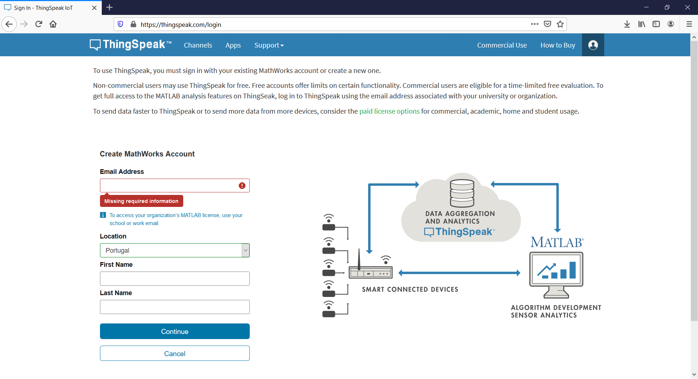
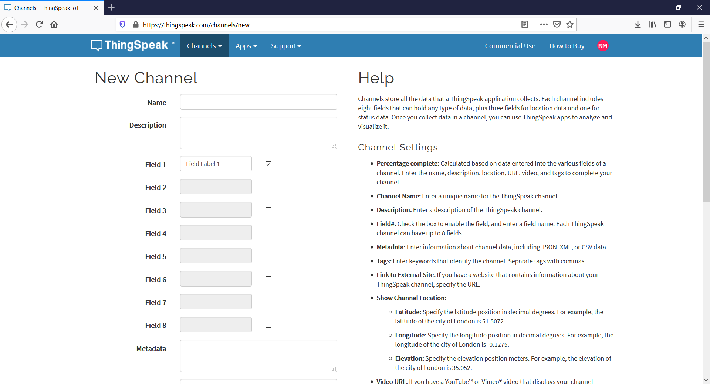
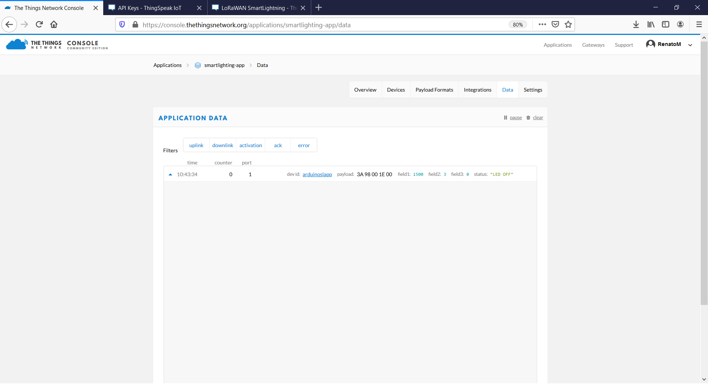
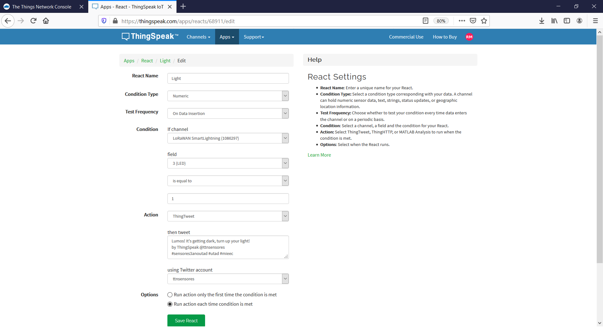

# SmartLightning

Para facilitar a leitura deste ficheiro, usar o vscode (ou similar) e colocar em modo "__preview__".

## _4ª Fase_

A quarta e última fase, consiste em passar os dados do The Things Network (TTN) para o The Things Speak (TTS), de forma a obter uma melhor análise dos valores enviados pelos sensores, recorrendo a gráficos fornecidos pela integração do TTS.<br>

Como resultado da 3ª fase, no The Things Network, obtemos o return dos seguintes fields através da função decoder.

### Payload Formats (TTN)

  ```js
    function Decoder(bytes, port) {
      
      ...

      return{
        field1: decoded.lux / 10,
        field2: decoded.vol / 10,
        field3: decoded.led,
        status: decoded.Status
      }   
    }
  ```

Estes fields serão então integrados no The Things Speak, tendo que, primeiramente criar uma conta.



Depois de a conta estar criada e iniciada, temos que ir a `Channels`, selecionar `My Channels` e posteriormente criar um `New Channel`.



Obtendo assim os seguintes campos:

__Channel ID:__ 1086297

__Write API Key__

  ```plan
  QVXCW9R40U22DLWQ
  ```

__Read API Key__

  ```plan
  ZTFU68DIOAYYDT4R
  ```

No TTN adicionamos a integração `The Things Speak`, na qual inserimos os campos obtidos.


Depois de adicionada, recebemos os dados já descodificados que automaticamente são integrados.

</br>

Sendo estes colocados nos respetivos gráficos.


O Things Speak ainda fornece a interação com algumas aplicações como o Twitter, que permite enviar um react caso seja cumprida uma condição de um field à escolha. 
Temos então que ir à opção das `Apps`, selecionar `ThingTweet` e associar a nossa conta `Link Twitter Account`. 
Posteriormente, na mesma opção, precisamos de criar o react em `React` e selecionar `New React`.



Obtendo assim uma reação ao field à escolha.

## Trabalho Realizado por

> Renato Mendes - 65384