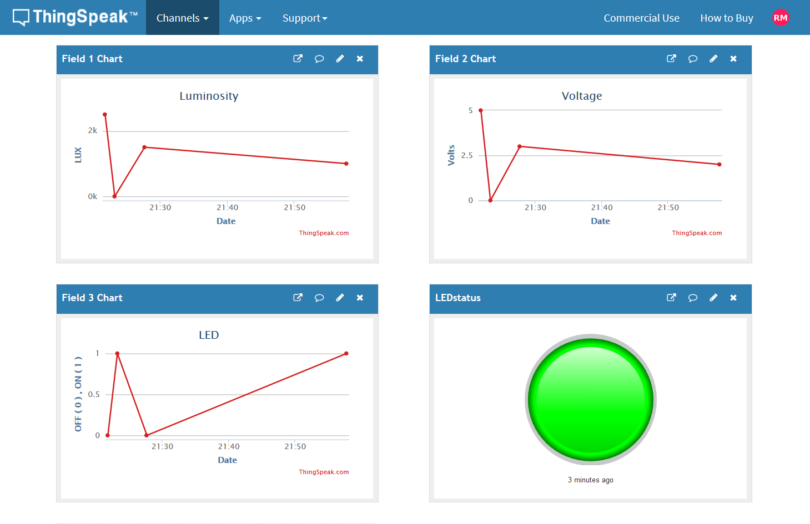

# SmartLightning

> IOT - Smart Lightning Application.

Para facilitar a leitura deste ficheiro, usar o vscode (ou similar) e colocar em modo "__preview__".

## Equipment

 <ul>
    <li>Arduino MKRWAN</li>
    <li>LDR Sensor</li>
    <li>Analog Ambient Light Sensor by DFRobot's</li>
    <li>LED</li>
    <li>10 KΩ Resistor</li>
    <li>220 Ω Resistor</li>
    <li>Breadboard</li>
    <li>Breadboard Wire</li>
 </ul>

 __LDR Specification__

 Ω in bright light<br>
 MΩ in darkness 

 __Analog Ambient Light Specification__

 Supply Voltage: 3.3V to 5V<br>
 Illumination range : 1 Lux to 6000 Lux<br>
 Responsive time : 15us<br>
 Interface: Analog<br>
 Size:22x30mm

## Overview

Este projeto tem como intuito a criação de uma aplicação Smart Lightning em IOT.</br>
Neste caso, iremos usar os dois sensores acima referidos, de forma a ter noção da `Luminosidade` e da `Tensão` a que está sujeito um espaço interior, mediante a luz solar que é incidida no mesmo, ligando ou desligando um LED. Este LED dispensa qualquer interação humana, o que permite obter um sistema inteligente e eficiente de ligar e desligar a luz, dependendo da condição exterior.</br>
É importante salientar o uso do protocolo LoRaWAN, através do arduino MKRWAN e do The Things Network, que torna possível não só armazenamento e análise de dados mas também, uma vantajosa interação com diversas aplicações que permite uma reação aos mesmos, desde enviar um tweet quando uma condição é cumprida (abordada neste trabalho), a uma aplicação de telemóvel que permite interagir com o dispositivo, sendo possível ligar e desligar a luz do LED através da mesma.

## Procedure and Results

Este projeto vai ser divido em 4 fases, cada fase encontra-se na sua respetiva pasta com uma explicação promenorizada. 

### 1ª Fase
 
Registo do dispositivo MKRWAN no `The Things Network`:

#### Device Overview (TTN)

  ```plan
  Application ID: smartlighting-app
  Device EUI: 009472084173A903
  Application EUI: 70B3D57ED002E395
  App Key: 6A21B5D4855D9595F888E6096BC2444B
  ```

### 2ª Fase

Leitura de valores dos sensores e posterior envio:

#### Code (Arduino)

```c
    // Leitura de valores
    // Read values
    lux = analogRead(lightSensor); 
    analogValue = analogRead(ldrSensor); 
    voltage = analogValue * (5.0 / 1023.0);

    resLrd = ((10000.0 * 5.0)/voltage) - 10000.0; //Low (voltage>>>2,5) ; High (voltage<<<2.4)

    if (millis() - time > 60000){
      luxValue = (float)lux * 0.6 + (float)luxValue * 0.4;
      lux = 0;
    
      voltageValue = (float)voltage * 0.6 + (float)voltageValue * 0.4;
      voltage = 0;

      if(voltageValue <= 2){
        digitalWrite(LED, HIGH);
        ledValue = 1;
        Serial.println("It's too dark, LED turn on!");
      } else {
        digitalWrite(LED, LOW);
        ledValue = 0;
        Serial.println("It's too bright, LED turn off!");
      }

      time = millis();
    }

    // Envio para o TTN de 10 em 10 minutos (600000ms)
    // Send to TTN every 10 minutes (600000ms)
    if (millis() - timeUpload > 600000){

      int valLux = (int)(luxValue * 10);
      txBuffer[0] = (valLux >> 8) & 0xff;
      txBuffer[1] = valLux & 0xff;

      int valVol = (int)(voltageValue * 10);
      txBuffer[2] = (valVol >> 8) & 0xff;
      txBuffer[3] = valVol & 0xff;

      txBuffer[4] = ledValue & 0xff;

      int err;
      modem.beginPacket();
      modem.write(txBuffer);
      err = modem.endPacket(true);

      timeUpload = millis();
    }
```
### 3ª Fase

Descodificar os dados recebidos:

#### Payload Formats (TTN)

```js
   function Decoder(bytes, port) {

      var decoded = {};

      if (port === 1){
        decoded.lux = ((bytes[0] << 8) | bytes[1]);
        decoded.vol = ((bytes[2] << 8) | bytes[3]);
        decoded.led = bytes[4]
        if(decoded.led == 1) decoded.Status = "LED ON";
        if(decoded.led === 0) decoded.Status = "LED OFF";
      }  

      return{
        field1: decoded.lux / 10,
        field2: decoded.vol / 10,
        field3: decoded.led,
        status: decoded.Status
      }   
   }
```

Resultado:


### 4ª Fase

Integração dos dados no  <a target="_blanc" href="https://thingspeak.com/channels/1086297"/>__The Things Speak__</a>:

</br>

React através do <a target="_blanc" href="https://twitter.com/ttnsensores"/>__Twitter__</a> quando o LED está ON:


## Culmination

Como esperado, podemos verificar o êxito de todas as fases.</br>
É de notar, que esta é uma simulação e não foi possível testar o equipamento devido ao ano atípico a que estivemos sujeitos (Covid-19), não permitindo analisar com precisão os resultados obtidos.</br>
Para concluir, este projeto foi desenvolvido no âmbito da Unidade Curricular: __Instrumentação e Sensores__, Curso: __Mestrado Integrado em Engenharia Eletrotécnica e de Computadores__, Universidade: <a target="_blanc" href="https://www.utad.pt"/>__UTAD__</a>.

## Trabalho Realizado por

> Renato Mendes - 65384
